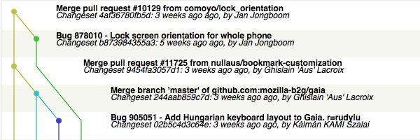
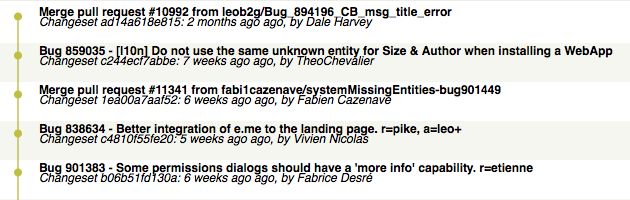
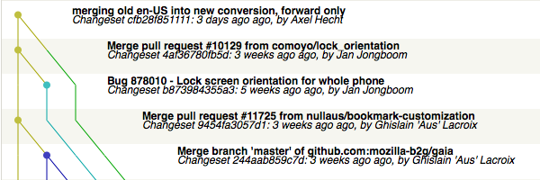
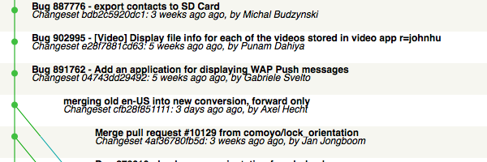

A tale of convert and convert
#############################
:date: 2013-09-19 07:49
:category: L10n, Mozilla
:tags: L10n, mercurial, Mozilla
:slug: a-tale-of-convert-and-convert

Or, how I made converting gaia to gaia-l10n suck less.

Background: For Firefox OS, we're exposing a modified repository to localizers, so that it's easier to find out what to work on, and to get support from the l10n dashboards. Files in the main gaia repository on github like

::

   apps/browser/locales/browser.en-US.properties

should become

::

   apps/browser/browser.properties

and the localizable sections in ``manifest.webapp``,

::

   {
   …
     "locales": {
       "en-US": {
         "name": "Browser",
         "description": "Gaia Web Browser"
       }
   …
   }

are exposed in ``manifest.properties`` as

::

   name: Browser
   description: Gaia Web Browser

We're also not supporting git on the l10n dashboard yet, so we need hg repositories.

I haven't come across a competitor to ``hg convert`` on the git side yet, so I looked on the mercurial side of life. I started by glancing of the code in ``hgext/convert`` in the upstream mercurial code. That does a host of things to get parents and graphs right, and I didn't feel like replicating that. It doesn't offer hooks for dynamic file maps, though, let alone content rewriting. But it's python, and it's open-source. `So I forked it <https://bitbucket.org/pike/gaiaconv>`__.

With ``hg convert``. Isn't that meta? That gives me a good path to update the extension with future updates to upstream mercurial. I started out with a conversion of mercurial 2.7.1, then `removed all the stuff <https://bitbucket.org/pike/gaiaconv/commits/652bd22b3bfc3fbed896ce2780ddafc871f593b2?at=default>`__ I don't need like bzr support etc. Then I made the mercurial code `do what I need <https://bitbucket.org/pike/gaiaconv/commits/a63c2f730e475f84d3704934477f97f74a3b8afd?at=default>`__ for gaia. I had to disable some checks that try to avoid commits that don't actually change the contents, because I don't mind that happening. And last but not least I added `the filemap and the shamap of the initial conversion <https://bitbucket.org/pike/gaiaconv/commits/376ab1ff30641a921557aa28308c1fc9b74106e6?at=default>`__ of ``hgext/convert``, so that future updates don't depend on my local disk.

Now I could just run ``hg gaiaconv`` and get what I want. Enter the legacy repositories for en-US. We only want fast-forward merges in hg, and in the conversion to git. No history editing allowed. But as you can probably guess, the new history is completely incompatible with the old, from changeset one. But I don't mind, I hacked that.

I did run the regular ``hg gaiaconv`` up to the revision 21000 of the ``integration/gaia-central`` repository. That ended up with the `graph for revision 4af36780fb5d <http://hg.mozilla.org/releases/gaia-l10n/v1_2/en-US/graph/4af36780fb5d>`__.

|gaia-central conversion|

I pulled the old conversion for v1-train, which is the `graph for revision ad14a618e815 <http://hg.mozilla.org/releases/gaia-l10n/v1_2/en-US/graph/ad14a618e815>`__.

|old en-US for v1-train|

Then I did a no-op merge of the `old graph into the new one <http://hg.mozilla.org/releases/gaia-l10n/v1_2/en-US/graph/cfb28f851111>`__.

|merge|

That's all good, but now future conversions via ``gaiaconv`` would still pick up the non-merged revision. Well, unless one just edits the generated shamap, and `replaces all references to 4af36780fb5d with cfb28f851111 <http://hg.mozilla.org/users/axel_mozilla.com/gaia-shamaps/rev/2e3342d517e8>`__. And yes, `that actually works <http://hg.mozilla.org/releases/gaia-l10n/v1_2/en-US/graph/58f649f61c59>`__.

|more conversions post-merge|

Tadaaa, a fully automated conversion process, and only forward merges.

Repositories involved in this post:

-  `Mercurial <http://selenic.com/hg>`__
-  `gaiaconv extension <https://bitbucket.org/pike/gaiaconv/>`__
-  `hg repository for 1.2 branch <https://hg.mozilla.org/integration/gaia-1_2/>`__
-  `en-US repo for v1-train <http://hg.mozilla.org/releases/gaia-l10n/v1_1/en-US/>`__
-  `en-US repo for 1.2 <http://hg.mozilla.org/releases/gaia-l10n/v1_2/en-US/>`__
-  `shamaps for en-US by gaiaconv <http://hg.mozilla.org/users/axel_mozilla.com/gaia-shamaps/>`__

