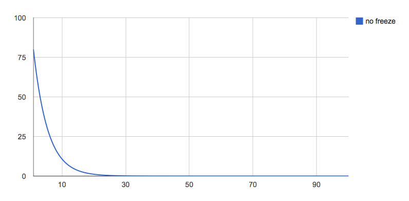
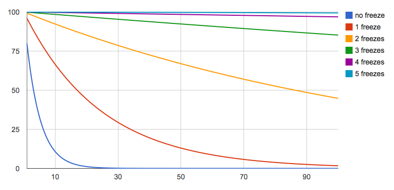

Risk management for releases at scale
#####################################
:date: 2013-02-15 08:26
:category: L10n, Mozilla
:tags: L10n, Mozilla
:slug: risk-management-for-releases-at-scale

Let me share some recent revelations I had. It all started with the infamous Berlin airport. Not the nice one in Tegel, but the BBI desaster. The one we've thought we'd open last year, and now we don't know which year.

Part of the newscoverage here in Germany was all about how they didn't do any risk analysis, and are doomed, and how that other project for the Olympics in London did do risk analysis, and got in under budget, ahead of time.

So what's good for the Olympics can't be bad for Firefox, and I started `figuring out the math <http://pike.github.com/release-scale/docs/math.html>`__ behind our risk to ship Firefox, at a given time, with loads of localizations. *How likely is it that we'll make it?*

Interestingly enough, the same algorithm can also be applied to a set of features that are scheduled for a particular Firefox release. Locales, features, blockers, product-managers, developers, all the same thing :-). Any bucket of N things trying to make a single deadline have similar risks. And the same cure. So bear with me. I'll sprinkle graphs as we go to illustrate. They'll `link to a site <http://pike.github.com/release-scale/>`__ that I've set up to play with the numbers, reproducing the shown graphs.

The setup is like this: Every single item (localization, for exampe) has a risk, and I'm assuming the same risk across the board. I'm trying to do that N times, and I'm interested in how likely I'll get all of them. And then I evaluate the impact of different amounts of freeze cycles. If you're like me, and don't believe any statistics unless they're done by throwing dices, check out the `dices demo <http://pike.github.com/release-scale/dices/>`__.

Anyway, let's start with 20% risk per locale, no freeze, and up to 100 locales.

|80%, no freeze, up to 100|

Ouch. We're crossing 50-50 at 3 items already, and anything at scale is a pretty flat zero-chance. Why's that? What we're seeing is an exponential decay, the base being 80%, and the power being how often we do that. This is **revelation one** I had this week.

How can we help this? If only our teams would fail less often? Feel free to play with the numbers, like setting the successrate from 80% to 90%. Better, but the system at large still doesn't scale. To fight an exponential risk, we need a cure that's exponential.

Turns out freezes are just that. And that'd be **revelation two** I had this week. Let's add some 5 additional frozen development cycles.

|80%, 5 freezes, up to 100|

Oh hai. At small scales, even just one frozen cycle kills risks. Three features without freeze have a 50-50 chance, but with just one freeze cycle we're already at 88%, which is better than the risk of each individual feature. At large scales like we're having in l10n, 2 freezes control the risk to mostly linear, 3 freezes being pretty solid. If I'm less confident and go down to 70% per locale, 4 or 5 cycles create a winning strategy. In other words, for a base risk of 20-30%, 4-5 freeze cycles make the problem for a localized release scale.

It's actually intuitive that freezes are (kinda) exponentially good. The math is a tad more complicated, but simplified, if your per-item success rate is 70%, you only have to solve your problem for 30% of your items in the next cycle, and for 9% in the second cycle. Thus, you're fighting scale with scale. You can see this in action on the `dices demo <http://pike.github.com/release-scale/dices/>`__, which plays through this each time you "throw" the dices.

Now onwards to my **third revelation** while looking at this data. Features and blockers are just like localizations. Going in to the rapid release cycle with Firefox 5 etc, we've made two rules:

-  Feature-freeze and string-freeze are on migration day from central to aurora
-  Features not making the freeze take the next train

That worked fine for a while, but since then, mozilla has grown as an organization. We've also built out dependencies inside our organization that make us want particular features in particular releases. That's actually a good situation to be in. It's good that people care, and it's good that we're working on things that have organizational context.

But this changed the risks in our release cycle. We started off having a single risk of exponential scale after the migration date (l10n). Today, we have features going in to the cycle, and localizations thereof. At this point, having feature-freeze and string-freeze being the same thing becomes a risk for the release cycle at large. We should think about how to separate the two to mitigate the risk for each effectively, and ship awesome and localized software.

I learned quite a bit looking at our risks, I hope I could share some of that.

