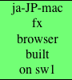

Triggering l10n builds
######################
:date: 2009-02-24 16:03
:category: L10n, Mozilla
:tags: L10n, Mozilla
:slug: triggering-l10n-builds

Localized builds are easy, you take away en-US, throw in the localized files, and you're done. Piece of cake.

Throw in 3 platforms, four different builds each, 70 locales, and you have a lot of cake.

Yesterday I wrapped up a little experiment that allows one to set up a testing environment for l10n builds, and I figured I'd share some of the outcome. The trick here is to take away the complexity of the actual build and abstract away things like getting the en-US binary, the right source repos etc, and to just focus on when l10n builds should do what. There are more details on what the actual l10n build is supposed to do on the `l10n deliverables page <https://wiki.mozilla.org/User:AxelHecht/L10n_build_deliverables>`__. The files for this experiment are in my temporary fork of `buildbotcustom/bin <http://hg.mozilla.org/users/axel_mozilla.com/buildbotcustom/file/tip/bin/>`__. The setup includes l10n builds, en-US regular builds, and en-US nightlies. As far as the interaction between en-US and l10n builds go, we don't need unittest and talos boxens here. All builds on this setup are fakes, that is, they take a few seconds (mac being quick, linux a tad slower, windows being slow), en-US builds taking longer than a l10n repack. The individual builds are represented by a yellow "Build 3" box, followed by a green box for the only step of that build. It displays some relevant information, in particular, which slave it's run on (there were two per platform, in one pool), which locale it's building, and what kind of build it is. Nightlies and regular en-US builds are easy, just the regular column names you're used to, but the l10n builds can use a little legend:

+----------------------------------------------------------------------------------------------------------------------------------------------------------------------------------------------+----------------+
| A build as triggered by a localizer, building Firefox for ja-JP-mac, on slave sw1 would look like this. That would be on Slave Windows 1 (starting with 0, this is the second slave).        | |l10n build 6| |
+----------------------------------------------------------------------------------------------------------------------------------------------------------------------------------------------+----------------+
| A build as triggered by a check-in for en-US, building Firefox for ja-JP-mac, on slave sw1. The difference here is that it's showing *compareOnly*, we'll see in the flow below why that is. | |l10n build 7| |
+----------------------------------------------------------------------------------------------------------------------------------------------------------------------------------------------+----------------+
| A nightly l10n build would again show the locale and the slave, in addition to the fact that it's a *nightly*.                                                                               | |l10n build 8| |
+----------------------------------------------------------------------------------------------------------------------------------------------------------------------------------------------+----------------+

All of these builds share the same builder, for all locales. Just the platforms require different builders, as they're delegating work to different groups of slaves. That's because in the end, it doesn't matter who or what caused that build to be made, the interesting point is whether the build is good or not. We're not using different builders per locale, just because that doesn't scale. In this test setup, there are 4 locales, but in real life, we have 70-ish. There's just not enough space in my flat for monitors to display that.

Let's move on to see some actual builds in action. Easiest first, as that looks most familiar to what we do with our regular builds. A localizer checks in, and in return, we do a build on all three platforms.

|localizer-triggered build|

You see the three *Firefox test* builds on each platform, which are the l10n builders. There is nothing on the *mozilla build* and *mozilla nightly* columns, which are the en-US builds and nightlies, resp. There's only one locale built, in this case, ja-JP-mac, which is the locale for which I had pushed content here. Note to the Japanese localizers, this is on my test setup, so the hg repos I pushed to were local, and in fact, didn't resemble anything close to your repos.

On to the next scenario, slightly more tricky. Nightly builds. Nightly builds for en-US are triggered by a scheduler that runs each day at a particular time. For l10n, we want repacks of those builds. Which implies that those builds are done, so we run them later.

|en-US and nightly l10n builds|

You can see a nightly build for each platform in en-US, linux being quick, mac slightly slower, windows being a bore. After a while, there is a l10n build for each locale (this setup has 4, ab, de, ja-JP-mac, x-testing) for each platform, being spread over the various slaves of the pool. Remember, we had two slaves per platform here. In real life, there are many more.

Now we start to see some pitfalls. The scheduler that triggers the nightly l10n builds needs to wait for the en-US builds, so despite the fact that the linux build is done, it's not scheduled before we expect the windows build to be done. Right, expect. There's actually no guarantee that the windows build, or any other platform for that matter, are actually done. We just delay the l10n builds to an extent that this isn't a problem in practice. Another pitfall are respins. If the nightly build is busted, we go in and trigger new nightly builds. The l10n scheduler doesn't know about those, so l10n builds are not respun. That's covered by `bug 469364 <https://bugzilla.mozilla.org/show_bug.cgi?id=469364>`__.

Now on to the really fun pieces. Let's look at what happens if a core developer checks in a patch that changes strings. Of course, that triggers the regular en-US builds. But what do we want to do for l10n? We should use this occasion to notify our l10n community that there is outstanding work, so there's good reason to actually start something right away. Let's look at what the builds do.

|en-US and l10n builds for a l10n-impact change|

You can see that the en-US builds kick off at the same time as the l10n builds. Now, what should the l10n builds do? Firstly, notify the localizer about the new strings. Good, let's do that. But what more? Really, nothing, the next good thing would be to show off the new strings in context, but as you can see from the waterfall (there is some good in waterfalls, lastly), the en-US builds are far from done so far. That's why the l10n builds have *compareOnly* set. These builds should merely run compare-locales and report the current string work on the dashboard, and be done with it.

Three kinds of builds for l10n. Why did I mention four initially? I left out the release builds. Those come with different rules and requirements. More details on aforementioned `l10n deliverables page <https://wiki.mozilla.org/User:AxelHecht/L10n_build_deliverables>`__.

For the curious ones thinking about how we can use our computing resources, and why sometimes builds take a while without something happening, you can see a nice battle between different builders over the same slave pools, in particular, the slightly cut off l10n builds were waiting on the en-US builds to free their resources.

I hope that this post gives you a more visual idea of what we need to do in l10n builds land, and why.

.. |l10n build 7| image:: images/2009/02/bild-7.png

.. |localizer-triggered build| image:: images/2009/02/bild-4.png
.. |en-US and nightly l10n builds| image:: images/2009/02/bild-5.png

